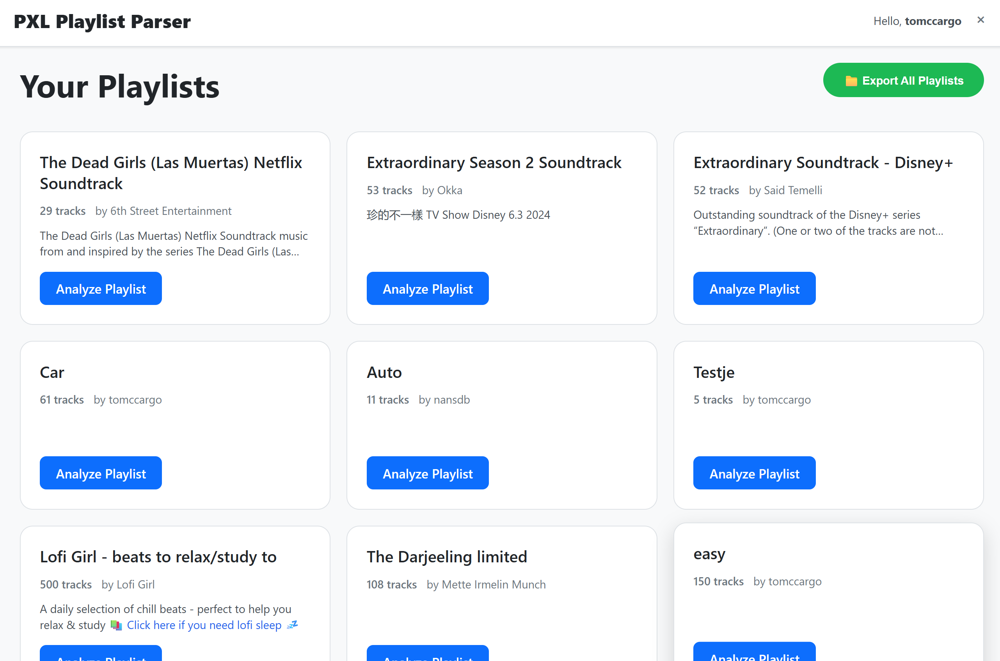
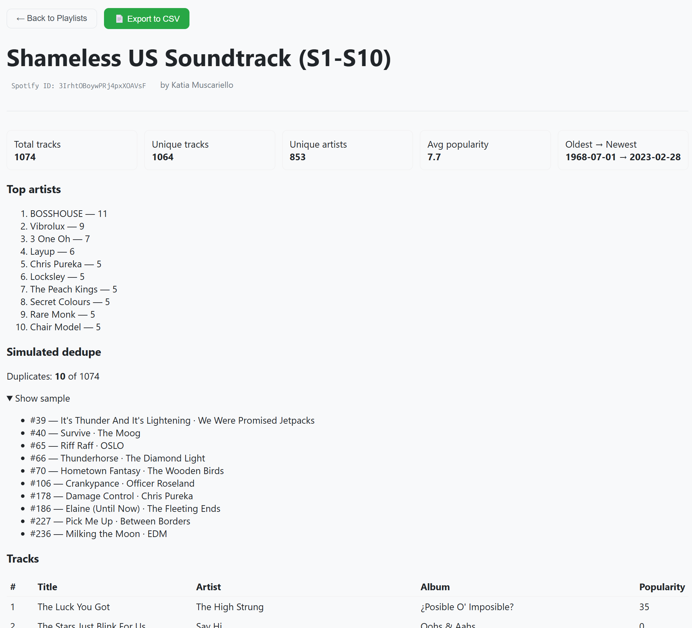
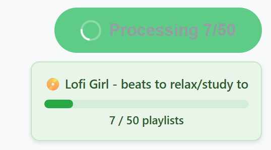
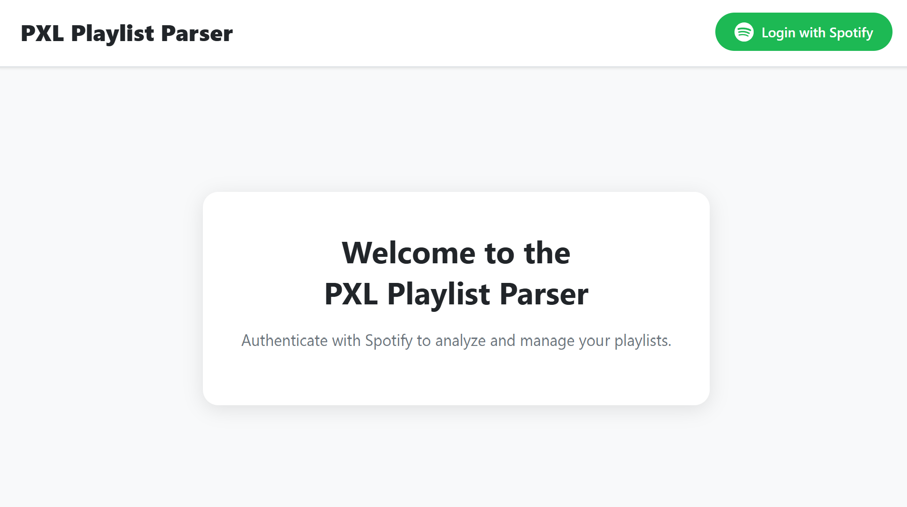

# PXL Playlist Parser

A comprehensive Spotify playlist analyzer built with Vue.js frontend and Fastify backend. Analyze your playlists, export data to CSV, visualize your musical taste, and simulate playlist operations without making changes to your actual playlists.



## Architecture

The application consists of three main services orchestrated by Docker Compose:

### Database Service

- **Technology**: PostgreSQL 17 Alpine
- **Port**: 5432
- **Purpose**: Stores user sessions, OAuth tokens, and authentication data
- **Data Persistence**: Uses Docker volume for data persistence across container restarts
- **Health Checks**: Monitors database readiness before starting dependent services

### API Backend Service

- **Technology**: Node.js with Fastify framework and Prisma ORM
- **Port**: 3000
- **Purpose**:
  - Spotify OAuth authentication and token management
  - Playlist data retrieval and analysis
  - CSV export functionality with progress tracking
  - Audio features analysis
  - Playlist statistics and deduplication simulation

### Frontend Service

- **Technology**: Vue.js 3 with Vue Router, served via Nginx
- **Port**: 5173 (mapped to container port 80)
- **Purpose**:
  - Modern responsive user interface
  - Real-time export progress tracking
  - Playlist visualization and analysis

## Features

### Playlist Analysis

- View all Spotify playlists (owned and followed)
- Detailed track statistics including artists, albums, popularity scores
- Release date analysis and track duration statistics
- Duplicate track detection with position information
- Playlist merging simulation showing overlap and union statistics



### Data Export

- **Individual Playlist Export**: Complete CSV with track metadata, audio features, and playlist information
- **Bulk Export**: All playlists exported to a single comprehensive CSV file
- **Progress Tracking**: Real-time progress updates during export process
- **Smart Filenames**: Auto-generated filenames with timestamps and user identification



### Security and Privacy

- Secure Spotify OAuth 2.0 implementation using Authorization Code flow
- Encrypted refresh token storage in PostgreSQL database
- Session-based authentication with signed cookies
- No permanent storage of actual music content or sensitive user data
- Read-only access to Spotify data (no playlist modifications)

## Spotify Integration

### OAuth Scopes

The application requests minimal necessary permissions:

- `playlist-read-private`: Access to private playlists
- `playlist-read-collaborative`: Access to collaborative playlists
- `user-read-email`: User profile information



### API Rate Limiting

- Handles Spotify's rate limiting (HTTP 429 responses)
- Implements retry logic with exponential backoff
- Batch processing for efficient API usage
- Automatic token refresh when access tokens expire

### Data Model

```prisma
model User {
  id           String   @id @default(cuid())
  spotifyId    String   @unique
  email        String?
  displayName  String?
  createdAt    DateTime @default(now())
  tokens       Token?
}

model Token {
  userId      String   @id
  accessToken String
  refreshEnc  String   // Encrypted refresh token
  scope       String
  expiresAt   DateTime
  user        User @relation(fields: [userId], references: [id], onDelete: Cascade)
}
```

## API Endpoints

### Authentication

```bash
GET  /auth/login                     # Initiate Spotify OAuth flow
GET  /auth/callback                  # Handle OAuth callback
POST /auth/logout                    # Clear user session
```

### User Data

```bash
GET  /me                             # Current user profile
GET  /me/playlists                   # List user playlists
GET  /me/audio-features              # Audio features analysis
```

### Playlist Operations

```bash
GET  /playlists/:id/contents         # Playlist tracks (paginated)
GET  /playlists/:id/stats            # Playlist statistics
GET  /playlists/:id/simulate-dedupe  # Duplicate detection (read-only)
GET  /playlists/:id/export           # Download playlist as CSV
```

### Bulk Operations

```bash
POST /playlists/export-all           # Start bulk export job
GET  /playlists/export-progress/:jobId  # Check export progress
GET  /playlists/download/:jobId      # Download completed export
```

### Utility

```bash
GET  /simulate-merge?a=PL1&b=PL2     # Compare two playlists
GET  /healthz                        # Health check endpoint
GET  /readyz                         # Readiness check endpoint
GET  /metrics                        # Prometheus metrics
```

## Development

### Local Development Setup

1. **API Development**

   ```bash
   cd api
   cp .env.example .env
   # Configure .env with your Spotify credentials
   docker compose up -d  # Starts database and API
   ```

2. **Frontend Development**

   ```bash
   cd frontend
   cp .......
   docker ......
   # Frontend available at http://127.0.0.1:5173
   ```
