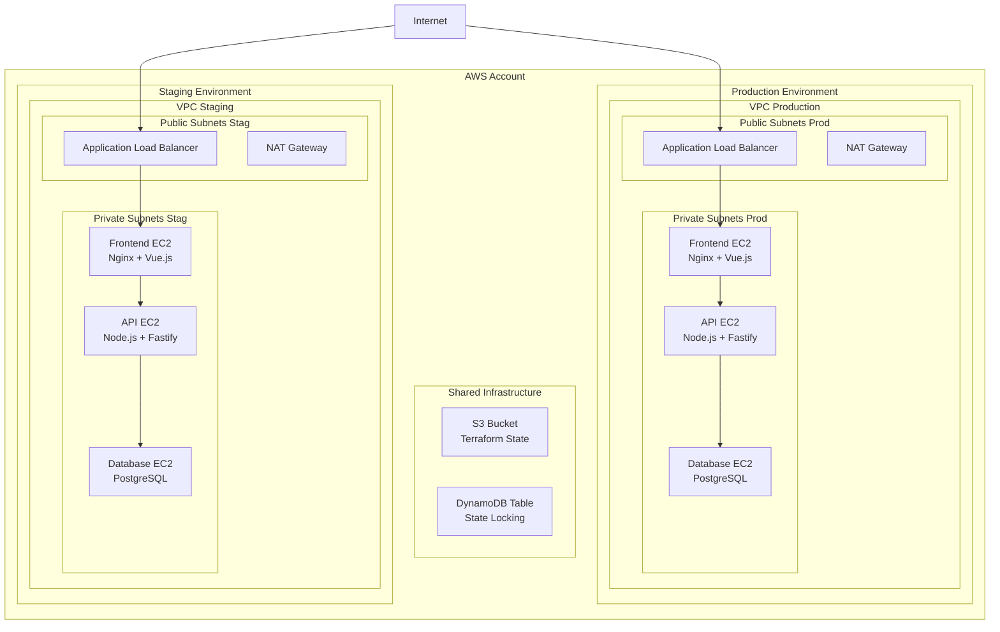

[](https://classroom.github.com/a/YUO9EaHe)
# Automation II - PE2.v2

In deze opdracht automatiseer je de deployment van de PXL Playlist Parser applicatie op AWS met Terraform (en optioneel Terragrunt). Je bouwt twee volledig gescheiden omgevingen (staging en production) met remote state, eigen VPC, EC2-tiers en PostgreSQL met persistente storage.

- [Beschrijving](#beschrijving)
- [Deployment Architectuur](#deployment-architectuur)
- [Basisopdracht - Minimumvereisten (8 punten)](#basisopdracht---minimumvereisten-8-punten)
  - [Te realiseren](#te-realiseren)
    - [1. Remote State Management (1 punt)](#1-remote-state-management-1-punt)
    - [2. Environment Structuur (1 punt)](#2-environment-structuur-1-punt)
    - [3. Terraform Modules (2 punten)](#3-terraform-modules-2-punten)
    - [4. Multi-Environment Deployment (2 punten)](#4-multi-environment-deployment-2-punten)
    - [5. Applicatie Deployment (2 punten)](#5-applicatie-deployment-2-punten)
  - [Output Requirements](#output-requirements)
  - [Verificatie](#verificatie)
- [Optionele Extra's (enkel beoordeeld indien minimum is bereikt)](#optionele-extras-enkel-beoordeeld-indien-minimum-is-bereikt)
  - [Extra 1: Terragrunt Implementation (5 punten)](#extra-1-terragrunt-implementation-5-punten)
  - [Extra 2: Advanced Security \& Monitoring (3 punten)](#extra-2-advanced-security--monitoring-3-punten)
  - [Extra 3: High Availability \& Auto Scaling (4 punten)](#extra-3-high-availability--auto-scaling-4-punten)
- [Belangrijke Aandachtspunten](#belangrijke-aandachtspunten)
  - [Stateful Application Challenges](#stateful-application-challenges)
  - [Spotify OAuth Configuration](#spotify-oauth-configuration)
- [Deliverables](#deliverables)
- [Belangrijke informatie](#belangrijke-informatie)
- [Puntenverdeling](#puntenverdeling)
- [Tips](#tips)
- [Belangrijk - regels](#belangrijk---regels)

---

## Beschrijving

Je gaat de PXL Playlist Parser applicatie deployen naar AWS met een volledig geautomatiseerde infrastructuursetup met Terraform modules, optioneel Terragrunt, en multiple environments. De applicatie bestaat uit:

- Vue.js frontend
- Node.js API backend (Fastify)
- PostgreSQL database

Je moet twee volledig gescheiden omgevingen opzetten:

- staging
- production

met gebruik van remote state management.

Belangrijk: deze applicatie is stateful. De PostgreSQL database bevat persistente gebruikersdata en OAuth tokens. Je architectuur moet dat respecteren.

---

## Deployment Architectuur



De extra standby database in production is enkel vereist als je Extra 3 uitwerkt.

---

## Basisopdracht - Minimumvereisten (8 punten)

Deze sectie bevat de verplichte onderdelen. Als deze minimumvereisten niet gehaald worden, worden de extra's niet beoordeeld.

### Te realiseren

#### 1. Remote State Management (1 punt)

Je richt remote state management in met:

- S3 bucket voor Terraform state storage

  - Versioning ingeschakeld
  - Server-side encryptie
  - Public access geblokkeerd
  - Bucket policy met beperkte access
- DynamoDB table voor state locking

  - Geschikt key schema voor Terraform locks
- Aparte state files per environment (staging en production)
- Backend configuratie in Terraform (remote backend configuratie is niet hardcoded in de modules)

Je moet kunnen aantonen, bijvoorbeeld via screenshot of CLI-output, dat:

- de state file effectief in S3 staat
- locks in DynamoDB verschijnen tijdens `terraform apply`

#### 2. Environment Structuur (1 punt)

Je gebruikt een duidelijke directory-structuur, gebaseerd op environments:

```bash
terraform/
├── modules/
│   ├── networking/
│   ├── compute/
│   └── database/
├── environments/
│   ├── staging/
│   │   ├── main.tf
│   │   ├── variables.tf
│   │   └── staging.tfvars
│   └── production/
│       ├── main.tf
│       ├── variables.tf
│       └── production.tfvars
└── global/
    └── state/
        ├── backend.tf
        └── globals.tf
```

Belangrijke punten:

- Environments zijn directory-based gescheiden.
- Modules bevatten geen environment-specifieke waarden.
- Environment-specifieke instellingen staan in de environment directories en tfvars files.

#### 3. Terraform Modules (2 punten)

Je maakt herbruikbare modules voor:

1. Networking module:

   - VPC met configureerbare CIDR
   - Ten minste 2 public subnets in verschillende AZs (voor ALB en NAT Gateway)
   - Ten minste 2 private subnets in verschillende AZs (voor applicatie instances)
   - Internet Gateway (1 per VPC)
   - NAT Gateway:

     - Slechts 1 NAT Gateway per VPC
     - NAT Gateway in één public subnet
     - Beide private subnets routeren via deze NAT Gateway
   - Route tables met correcte routes:

     - Public route table met route naar Internet Gateway
     - Private route table met route naar NAT Gateway

2. Compute module:

   - EC2 instances met configureerbaar:

     - instance type
     - aantal instances (count)
   - Security groups volgens principle of least privilege
   - Launch template(s) met user data scripts

     - Gebruik bij voorkeur `templatefile()` om user data scripts als aparte files te beheren
     - De user data ontvangt o.a. environment variabelen voor DB en Spotify

3. Database module:

   - EC2 instance(s) voor PostgreSQL
   - EBS volume voor data persistentie (aparte data-disk is toegelaten maar niet verplicht)
   - Security group:

     - Inbound: alleen PostgreSQL poort (5432) vanaf de API security group

### Spotify OAuth Configuration (Terraform Integratie Samenvatting)

Voor elke environment (staging & production) beheer je de Spotify OAuth waarden via Terraform `*.tfvars`:

```
spotify_client_id     = "<JE_CLIENT_ID>"
spotify_client_secret = "<JE_CLIENT_SECRET>"
spotify_redirect_uri  = "http://<alb-dns>/api/auth/callback"
```

De exacte redirect URI moet overeenkomen met wat je in de Spotify Developer Dashboard hebt ingesteld. Na een `terraform apply` krijg je een output `spotify_redirect_uri` waarmee je de waarde kunt kopiëren naar het dashboard (of vice versa).

Snelle stappen:
1. Terraform deploy → noteer `terraform output spotify_redirect_uri`.
2. Ga naar https://developer.spotify.com/dashboard → open je app → voeg deze redirect URI toe exact (HTTP vs HTTPS moet kloppen).
3. Kopieer Client ID & Secret naar de tfvars file (nooit committen met echte secrets in publieke repos).
4. `terraform apply -var-file=staging.tfvars` opnieuw draaien als je waarden wijzigt.
5. Test login: Open frontend → Login met Spotify → succesvolle redirect terug naar `/api/auth/callback`.

Foutdiagnose:
* Mismatch fout bij Spotify: redirect verschilt (host / protocol / pad). Corrigeer in dashboard & tfvars.
* 400 op callback: controleer dat `SPOTIFY_CLIENT_ID/SECRET/REDIRECT_URI` in instance env aanwezig zijn (user data / launch template).
* Lege waarden: OAuth start wel maar faalt bij token exchange → vul tfvars correct in.

Veiligheid:
* Gebruik voor productie liefst HTTPS (ALB + ACM certificaat) zodat auth code niet in plain text reist.
* Client Secret nooit in logs of outputs; Terraform markeert deze variabele als `sensitive`.

     - Outbound: minimaal, enkel wat nodig is voor package updates en backups
   - Backup configuratie:

     - EBS snapshots via Terraform resources
     - Een praktische, geautomatiseerde manier om daily snapshots te nemen (bijvoorbeeld via AWS Backup of EventBridge rule met Lambda is toegestaan, maar mag simplistisch zijn zolang daily snapshots aantoonbaar zijn)

Modules moeten parameters accepteren voor environment-specifieke configuratie (bijvoorbeeld CIDR, instance types, counts, naamgeving, tags).

#### 4. Multi-Environment Deployment (2 punten)

Je deployt twee volledig gescheiden environments:

Staging environment:

- Frontend:

  - 1 x t3.micro EC2 instance
- API:

  - 1 x t3.micro EC2 instance
- Database:

  - 1 x t3.small EC2 instance
- VPC CIDR: 10.0.0.0/16

Production environment:

- Frontend:

  - 2 x t3.small EC2 instances (redundantie)
- API:

  - 2 x t3.small EC2 instances (redundantie)
- Database:

  - 1 x t3.medium EC2 instance
- VPC CIDR: 10.1.0.0/16

Voor beide environments:

- Eigen VPC (geen shared VPC)
- Eigen Application Load Balancer
- ALB health checks op `/healthz` endpoint (minstens voor de API en bij voorkeur ook voor de frontend)
- Staging en production mogen dezelfde modules hergebruiken, maar moeten afzonderlijk uit te rollen zijn (bijvoorbeeld `terraform workspace` of aparte environment directories; in deze opdracht focussen we op directories).

#### 5. Applicatie Deployment (2 punten)

Je deployt de applicatie op de EC2 instances per tier.

Frontend EC2:

- Build van de Vue.js applicatie tijdens deployment
- Configuratie van Nginx als static file server voor de gebuilde frontend
- Security group:

  - Inbound: enkel vanaf ALB op poort 80 (of 443 indien je TLS implementeert)
  - Geen directe toegang vanaf het internet

API EC2:

- Security group:

  - Inbound: enkel vanaf ALB (indien ALB rechtstreeks naar API routeert) of vanaf frontend tier, afhankelijk van je architectuur
  - Poort beperkt tot de API-poort (bijvoorbeeld 3000 of 8080)

Database EC2:

- EBS volume voor data persistentie:

  - Data-directory van PostgreSQL op EBS-volume
- Security group:

  - Inbound: TCP 5432 enkel vanaf API security group
  - Outbound: minimaal, enkel nodig voor package updates en eventuele backups
- Backupstrategie:

  - Daily EBS snapshots
  - Retention:

    - 7 dagen voor staging
    - 30 dagen voor production

Application Load Balancer:

- Target groups:

  - Frontend target group
  - API target group (bv. path `/api/*`)
- Path-based routing:

  - Bijvoorbeeld:

    - `/` naar frontend target group
    - `/api/*` naar API target group
- Health checks:

  - Minstens op `/healthz` endpoint voor de API
  - Frontend health check kan bijvoorbeeld op `/` of `/index.html`
- Security group:

  - Inbound: HTTP (en eventueel HTTPS) vanaf het internet
  - Outbound: naar de relevante target instances

Session- en state-aspect voor de API:

- Vergeet niet bij multiple instances in production dat de applicatie stateful is.

---

### Output Requirements

Voor elke environment moeten minstens de volgende outputs gedefinieerd zijn in Terraform:

- Application URL (ALB DNS naam)
- Environment name
- VPC ID en VPC CIDR block
- Database connection string of een DB endpoint output voor troubleshooting
- Instance IDs per tier (frontend, API, database)

Outputs moeten duidelijk benoemd en bruikbaar zijn tijdens de demo.

---

### Verificatie

Tijdens de demo en/of bij controle wordt nagegaan of:

1. Beide environments volledig functioneel zijn:

   - Staging URL werkt
   - Production URL werkt
   - Frontend laadt correct
   - API endpoints reageren correct (bijvoorbeeld via curl of browser)

2. State management werkt:

   - Terraform state staat in S3
   - DynamoDB table toont locks tijdens een `terraform apply`
   - Je kunt bijvoorbeeld met een screenshot of korte uitleg tonen waar de state zich bevindt

3. Database data persistent is:

   - Demonstratie van data die een instance-restart overleeft:

     - Voeg bijvoorbeeld een testgebruikersrecord toe
     - Reboot de database EC2 instance
     - Toon dat de data nog aanwezig is

4. Applicatie volledig werkt inclusief Spotify OAuth flow:

   - Login via Spotify werkt in staging en production
   - Tokens worden opgeslagen in de database
   - Redirect URIs zijn correct geconfigureerd per environment

---

## Optionele Extra's (enkel beoordeeld indien minimum is bereikt)

Deze extra's zijn optioneel, maar brengen je totale score op tot maximaal 20/20. Ze worden alleen beoordeeld als de basisopdracht (8 punten) aantoonbaar werkt.

### Extra 1: Terragrunt Implementation (5 punten)

Doel: DRY (Don't Repeat Yourself) configuratie voor meerdere omgevingen met Terragrunt.

Eisen:

- Gebruik Terragrunt om:

  - Gemeenschappelijke configuratie (remote state, provider config, tags, enz.) te centraliseren in een root `terragrunt.hcl`
  - Environment-specifieke overrides per environment-directory
  - Dependencies tussen modules te definiëren (bijvoorbeeld networking voor compute)
  - Remote state configuratie automatisch in te stellen per environment

Voorbeeld directory structuur:

```bash
terragrunt/
├── terragrunt.hcl                  # root config (remote state, provider defaults, tags)
├── staging/
│   ├── terragrunt.hcl              # env-specifieke variabelen
│   ├── networking/
│   │   └── terragrunt.hcl
│   ├── compute/
│   │   └── terragrunt.hcl
│   └── database/
│       └── terragrunt.hcl
└── production/
    ├── terragrunt.hcl
    ├── networking/
    │   └── terragrunt.hcl
    ├── compute/
    │   └── terragrunt.hcl
    └── database/
        └── terragrunt.hcl
```

Beoordelingscriteria:

- Hergebruik van dezelfde modules met verschillende configuratie per environment
- Geen dubbele configuratie voor backend en providers
- Correct gebruik van `dependencies` in Terragrunt waar nodig

### Extra 2: Advanced Security & Monitoring (3 punten)

Doel: veiligere secrets handling en basis monitoring/logging met CloudWatch.

Secrets Management:

- Spotify OAuth credentials:

  - Via Terraform variables, waarden in `terraform.tfvars` of `*.auto.tfvars`
  - `SPOTIFY_CLIENT_ID`
  - `SPOTIFY_CLIENT_SECRET`
  - `SPOTIFY_REDIRECT_URI`
- Database passwords:

  - Gegenereerd via `random_password` resource in Terraform of een gelijkaardig mechanisme
- Secrets doorgeven naar EC2 instances:

  - Via environment variables in user data scripts
  - Of via een eenvoudige configuratiefile gegenereerd door user data
- `.tfvars` files en secrets:

  - Worden niet gecommit naar Git
  - README bevat een korte beschrijving van welke variables lokaal ingesteld moeten worden

Monitoring & Logging:

- Installatie van CloudWatch agent op alle EC2 instances (frontend, API, database)
- Logcollectie:

  - API: `/var/log/playlistparser-api.log` (of een equivalent pad, duidelijk gedocumenteerd)
  - Frontend: `/var/log/nginx/access.log` en `/var/log/nginx/error.log`
  - Database: `/var/log/postgresql/postgresql.log` (naam kan per distro verschillen, documenteer dit)
- Minstens 2 CloudWatch alarms:

  - CPU gebruik > 80% gedurende meer dan 5 minuten
  - Diskgebruik > 90 procent op het root- of data-volume

### Extra 3: High Availability & Auto Scaling (4 punten)

Doel: verhoogde beschikbaarheid en schaalbaarheid, vooral voor de production environment.

Voor production environment:

Frontend tier:

- Auto Scaling Group (ASG) voor frontend instances:

  - Min: 2
  - Max: 4
  - Desired: 2
- Scaling policies:

  - Scale up bij CPU > 70 procent gedurende 2 minuten
  - Scale down bij CPU < 30 procent gedurende 10 minuten
- Target group:

  - Health checks op `/` (frontend)
- ASG moet gekoppeld zijn aan de ALB target group

API tier (optioneel, maar pluspunt als uitgewerkt):

- Je mag ook een ASG voor de API voorzien met gelijkaardige parameters. Dit is geen harde eis, maar toont een verder gevorderde setup.

Database high availability:

- Tweede t3.medium instance als standby in een andere AZ
- PostgreSQL streaming replication configureren:

  - Basisconfiguratie is voldoende (primary en standby, async)
  - Configuratie mag via user data, script of handmatig voorbereid script gebeuren
- Automated daily backups via `pg_dump` naar S3 bucket:

  - Simpel cronjobscript op de primary database is voldoende
  - S3 bucket met server-side encryptie
  - Retentie kan via S3 lifecycle rules

Voor staging environment:

- Geen auto scaling vereist (vaste 1 instance per tier)
- Database:

  - Single instance met daily EBS snapshots volstaat

---

## Belangrijke Aandachtspunten

### Stateful Application Challenges

De applicatie gebruikt PostgreSQL voor:

- User authentication tokens
- OAuth refresh tokens (encrypted)
- Session persistence

Implicaties:

- Database moet persistente storage hebben (EBS volumes, geen ephemeral storage)
- API-servers hebben een betrouwbare databaseconnectie nodig
- Bij scaling van frontend en API moet je rekening houden met de statefullness van de applicatie.

Je moet in je `README.md` kort toelichten hoe jouw oplossing hiermee omgaat (zelfs als je een eenvoudige aanpak kiest).

### Spotify OAuth Configuration

Per environment configureer je een aparte Spotify app:

- Staging:

  - Redirect URI: `http://<staging-alb-dns>/auth/callback`
- Production:

  - Redirect URI: `http://<production-alb-dns>/auth/callback`

Client ID en Secret:

- Via environment variables aan de API doorgeven:

  - `SPOTIFY_CLIENT_ID`
  - `SPOTIFY_CLIENT_SECRET`
  - `SPOTIFY_REDIRECT_URI`
- Deze waarden in `terraform.tfvars` of gelijkaardige niet-gecommit-te-file bewaren
- Database credentials via environment variables:

  - `DATABASE_URL`: `postgres://user:password@<db-private-ip>:5432/playlistparser`

In de README moet duidelijk staan:

- Hoe en waar Spotify credentials en database-credentials ingesteld worden
- Welke variabelen verplicht zijn voor een succesvolle deployment

---

## Deliverables

Je repository moet er in grote lijnen als volgt uitzien:

```bash
submission/
├── README.md                # deployment instructies en documentatie
├── terraform/
│   ├── modules/
│   └── environments/
├── terragrunt/              # indien Extra 1
└── scripts/                 # helper scripts
    ├── deploy_staging.sh    # of equivalent
    ├── deploy_production.sh # of equivalent
    └── overige scripts
```

1. Terraform code:

   - Duidelijke module-structuur (networking, compute, database)
   - Environments als aparte directories
   - Remote state configuratie
   - Geen hardcoded secrets

2. Documentatie (README.md):

   Minstens volgende onderdelen:

   - Prerequisites:

     - Nodige tools (Terraform versie, Terragrunt versie indien gebruikt, AWS CLI)
     - Benodigde AWS-credentials (profiel of omgeving)
   - Setup instructies:

     - Hoe tfvars aan te maken
     - Hoe S3 bucket en DynamoDB table voor state te initialiseren (indien niet via Terraform)
   - Environment-specifieke configuratie:

     - Welke variabelen verschillen tussen staging en production
     - Resource sizing (instance types, aantallen)
   - Deployment stappen voor beide environments:

     - Concrete commandos, bijvoorbeeld:

       - `cd terraform/environments/staging`
       - `terraform init -backend-config=...`
       - `terraform apply -var-file=staging.tfvars`
   - Secrets management:

     - Beschrijving van hoe Spotify en database credentials beheerd worden
     - Duidelijk vermelden dat `.tfvars` met secrets niet gecommit worden
   - Korte uitleg over hoe de applicatie getest kan worden:

     - URL's
     - Basis scenario (OAuth login, playlists ophalen, enz.)

3. Demo requirements:

   Tijdens de demo moet je kunnen tonen:

   - Werkende applicatie in beide environments (staging en production)
   - Remote state in S3 en lock in DynamoDB
   - Database persistentie:

     - Data die een reboot overleeft
   - Environment isolatie:

     - Staging en production zijn gescheiden (eigene VPC's, ALB's, enz.)

4. Extra bewijsstukken (aanbevolen of verplicht indien gevraagd in de evaluatie):

   - Korte tekst of screenshot in README van:

     - `terraform plan` en/of `terraform apply`
     - S3 state bucket
     - DynamoDB lock table
   - Link naar relevante AWS console pagina's is toegestaan als extra verduidelijking.

5. Git-historiek:

   - Er moet regelmatig gecommit worden:

     - Minstens 1 commit per uur effectief werk

---

## Belangrijke informatie

- **Containers zijn niet toegestaan. Alle software draait rechtstreeks op EC2 instances**.
- Git commits:

  - Regelmatige commits (minstens 1 per uur werk)
  - Commits moeten logisch gegroepeerd zijn (geen grote monolithische eindcommit)
- Code:

  - Modulair en herbruikbaar
  - Geen environment-specifieke hardcoded waarden in modules
- Configuratie:

  - Gebruik environment-specifieke tfvars files
  - Documenteer alle belangrijke configuratiekeuzes in README
- Test beide environments grondig voor de deadline.

---

## Puntenverdeling

Minimum vereisten (8/20 punten)

Optionele extra's (max 12/20 punten):

- Terragrunt Implementation: 5 punten
- Advanced Security & Monitoring: 3 punten
- High Availability & Auto Scaling: 4 punten

Totaal mogelijk: 20/20 punten

Extra's worden alleen toegekend als de basisopdracht aantoonbaar werkt.

---

## Tips

- Begin met de globale infrastructuur:

  - S3 bucket en DynamoDB voor state
  - Provider configuratie
- Start met 1 environment (bijvoorbeeld staging):

  - Maak deze volledig werkend
  - Generaliseer daarna naar modules en voeg production toe
- Test database persistentie vroeg:

  - Maak een testrecord
  - Reboot instance
  - Controleer data
- User data scripts worden snel complex:

  - Overweeg een duidelijke structuur met `templatefile()` en aparte shellscripts
- Database-initialisatie:

  - Kan via user data, maar ook via een separate script of eenvoudige provisioner
  - Documenteer wat je gekozen hebt en waarom

---

## Belangrijk - regels

- De oplossing moet testbaar zijn vanaf een andere machine of cloudomgeving via de ingediende repository.
- Deliverables worden beoordeeld op het moment van de deadline.

  - De toestand van de repository op de deadline is leidend.
  - Als de ingeleverde oplossing niet werkt, of als de clusters/omgevingen tijdens de demo verschillen van de ingeleverde oplossing, moet je een volledige lijst van verschillen expliciet melden. Niet melden betekent score 0.
- Alle bestanden moeten voor de deadline gecommit en gepusht zijn.

  - Bestanden die na de deadline toekomen, worden genegeerd.
  - Commits na de deadline leveren min 2 punten op en worden inhoudelijk niet behandeld.
- Er wordt uitsluitend individueel gewerkt.
- Plagiaat is verboden (zie PXL-examenreglement).

  - Dit geldt voor zowel het overnemen van code als het doorgeven van eigen oplossingen.
  - Er mag niet gecommuniceerd worden over deze PE met andere studenten (ook niet via chat of schermdeling).
- Overtredingen tegen de plagiaatregels kunnen leiden tot zware sancties, inclusief uitsluiting van examens.
- Niet naleven van de commitvereiste (minstens 1 commit per uur werk) kan leiden tot score 0.

